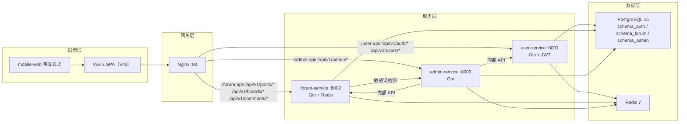

# 项目上下文 · AI 智联论坛

> 本文档旨在让 AI 助手在每次新对话中快速理解项目全貌。
> 修改项目结构或重要约定时，请同步更新本文件。

---

## 1. 项目定位

**AI 智联论坛**是一个面向学院的 AI 主题社区平台（MVP 阶段）。核心场景：学生按板块浏览讨论 AI 话题，协会运营进行内容治理。

- **目标用户**：学生（浏览/发帖/互动）、协会运营（审核/管理）、平台管理员（配置/封禁）
- **系统边界**：社区内容 + 用户身份 + 运营中台，不涉及即时通讯、实时协作等企业级功能

---

## 2. 技术架构总览

### 2.1 架构图



### 2.2 技术栈

| 层 | 技术 | 版本 |
|----|------|------|
| 前端框架 | Vue 3 + Composition API | `^3.5` |
| 构建工具 | Vite | `^8.0` |
| CSS | Tailwind CSS 4 + `tailwind-merge` | `^4.3` |
| 状态管理 | Pinia | `^3.0` |
| 路由 | Vue Router | `^5.0` |
| UI 库 | radix-vue + lucide-vue-next | `^1.9` / `^1.0` |
| 粒子效果 | tsparticles | `^4.2` |
| 后端框架 | Gin（Go） | `v1.9.1` |
| 数据库 | PostgreSQL 16 | — |
| 缓存/会话 | Redis 7 | — |
| 数据库迁移 | golang-migrate | `v4.17` |
| DB 驱动 | pgx/v5 | `v5.5` |
| JWT | golang-jwt/jwt/v5 | `v5.2` |
| 网关 | Nginx（alpine） | — |
| 容器化 | Docker Compose | — |

### 2.3 API 前缀与端口

| 服务 | 内部端口 | Nginx 前缀 | 说明 |
|------|----------|------------|------|
| user-service | 8001 | `/user-api/`, `/api/v1/auth/`, `/api/v1/users`, `/api/v1/register`, `/api/v1/login`, `/api/v1/demo-login` | 注册/登录/用户资料/JWT |
| forum-service | 8002 | `/forum-api/`, `/api/v1/posts`, `/api/v1/boards`, `/api/v1/comments`, `/api/v1/attachments` | 板块/帖子/评论/互动 |
| admin-service | 8003 | `/admin-api/`, `/api/v1/admin/` | 审核/配置/敏感词/统计 |
| frontend | 80 | `/` | Vue SPA 静态文件 |

**本地开发时** Vite 开发服务器在 `127.0.0.1:8091`，通过 vite proxy 转发到各后端。

---

## 3. 目录结构与职责

```
New project 6/
├── AGENTS.md                  ← 本文件（AI 上下文入口）
├── frontend/                   Vue 3 SPA 前端
│   ├── src/
│   │   ├── api.js              所有 API 调用（已封装 camelCase 映射）
│   │   ├── api/http.js         Axios 实例 + 401 拦截自动刷新 token
│   │   ├── router.js           Vue Router 路由定义
│   │   ├── main.js             入口：注册插件、挂载 App
│   │   ├── stores/session.js   Pinia 用户会话状态
│   │   ├── composables/        可组合函数（评论树、历史、导航等）
│   │   ├── components/ui/      shadcn-vue 风格 UI 组件
│   │   ├── views/              页面视图（BoardView, PostDetail, Admin* 等）
│   │   └── styles/             Tailwind + gx 主题 CSS
│   ├── vite.config.js          代理配置（user/forum/admin-api → 后端）
│   └── package.json
├── services/                   Go 微服务
│   ├── user/                   user-service（用户身份限界上下文）
│   │   ├── cmd/main.go         入口
│   │   ├── internal/handler/   HTTP 处理器
│   │   ├── internal/service/   业务逻辑层
│   │   ├── internal/model/     数据模型
│   │   ├── internal/middleware/ JWT 中间件
│   │   ├── internal/repository/ 数据库访问层
│   │   ├── pkg/database/       PostgreSQL 连接
│   │   ├── pkg/jwt/            JWT 工具
│   │   └── pkg/redis/          Redis 连接
│   ├── forum/                  forum-service（社区内容限界上下文）
│   │   └── （同上分层结构）
│   └── admin/                  admin-service（运营治理限界上下文）
│       └── （同上分层结构）
├── shared/                     共享契约
│   ├── api-contract.md         前后端字段映射表（snake_case ↔ camelCase）
│   └── mock-data/              JSON 种子数据
├── nginx/                      网关配置
│   ├── nginx.conf              主配置（路由规则）
│   └── includes/               模块化配置片段
├── migrations/                 数据库迁移脚本
│   └── init/

~~├── scripts/seed/             种子数据 SQL~~
├── infra/                      基础设施配置
├── docs/                       项目文档（见第 8 节索引）
├── mobile-web/                 移动端窄屏适配样式
├── docker-compose.yml          完整环境编排
├── docker-compose.dev.yml      本地开发编排
├── docker-compose.prod.yml     生产环境编排
├── .env.example                环境变量模板
└── DEPLOY.md                   部署指南
```

---

## 4. 核心业务领域（限界上下文）

### 4.1 BC-Identity · user-service

- **聚合**：User（注册/登录/资料/头像）、Session（JWT 签发/刷新/登出）
- **角色**：student / admin / platform_admin
- **数据主权**：`schema_auth`，其他上下文不得直连此 Schema
- **关键路由**：
  - `POST /api/v1/register` — 邀请码注册
  - `POST /api/v1/login` — 用户名密码登录
  - `POST /api/v1/demo-login` — 演示账号快捷登录
  - `GET/PUT /api/v1/users/me` — 当前用户资料
  - `GET /api/v1/users/public/:id` — 他人公开资料

### 4.2 BC-Community · forum-service

- **聚合**：Board（板块）、Post（帖子）、Comment（评论，支持嵌套）、Interaction（点赞/收藏）、Attachment（附件）
- **数据主权**：`schema_forum`
- **关键路由**：
  - `GET /api/v1/boards` — 板块列表
  - `GET/POST /api/v1/posts` — 帖子列表/发帖
  - `GET/PUT/DELETE /api/v1/posts/:id` — 帖子详情/编辑/删除
  - `GET/POST /api/v1/comments` — 评论列表/发表评论
  - `POST /api/v1/interactions` — 点赞/收藏
- **与 admin 关系**：发帖/评论时调用 admin 敏感词检测；admin 可通过内部 API 删帖/改板块

### 4.3 BC-Governance · admin-service

- **聚合**：Audit（审核）、Config（系统配置）、SensitiveWord（敏感词）、InviteCode（邀请码）、Stats（统计）
- **数据主权**：`schema_admin`
- **关键路由**：
  - `GET /api/v1/admin/overview` — 管理概览
  - `GET/POST/PUT /api/v1/admin/users` — 用户管理
  - `GET /api/v1/admin/audit` — 审核队列
  - `GET/PUT /api/v1/admin/config` — 系统配置
  - `GET/POST/DELETE /api/v1/admin/sensitive-words` — 敏感词管理
  - `GET/POST /api/v1/admin/invite-codes` — 邀请码管理

---

## 5. 开发工作流

### 5.1 纯前端开发（不依赖后端）

```bash
cd frontend
npm run dev        # → http://127.0.0.1:8091
```

### 5.2 完整 Docker 环境

```bash
# 启动所有服务（PostgreSQL + Redis + 3 Go 服务 + Nginx + 前端）
docker compose up -d

# 开发环境（带热重载）
docker compose -f docker-compose.dev.yml up -d

# 查看日志
docker compose logs -f forum-service
```

### 5.3 单独运行 Go 服务

```bash
cd services/forum
cp .env.example .env   # 编辑数据库连接信息
go run cmd/main.go     # 默认监听 :8002
```

### 5.4 多 agent 开发编队

- **适用场景**：当任务涉及前端、后端、数据库、部署、测试等多个边界，或单一 agent 难以同时高质量推进时，默认采用多 agent 编队协作。
- **编队角色**：
  - **主控 agent**：负责理解用户目标、拆分任务、维护整体计划、整合结果，并最终对交付质量负责。
  - **前端 agent**：负责 Vue 页面、组件、移动端适配、交互和前端接口对接。
  - **后端 agent**：负责 Gin 服务、接口、业务逻辑、权限、服务间调用。
  - **集成契约 agent**：负责对照 `shared/api-contract.md`、`frontend/src/api.js`、Nginx/Vite proxy，检查字段映射和路由错位。
  - **数据/部署 agent**：负责迁移脚本、Docker Compose、Nginx、云服务器部署和环境排查。
  - **测试/审查 agent**：负责回归测试、移动端窄屏检查、接口联调、风险审查。
- **协作原则**：
  - 主控 agent 必须先明确任务边界和改动范围；存在不确定时，先询问用户再继续。
  - 多 agent 并行前，应避免多个 agent 同时修改同一文件或同一业务边界。
  - 每个子 agent 的输出必须包含：改动范围、验证方式、遗留风险、是否影响发布。
  - 主控 agent 需要记住最近两次代码改动，避免重复修改或互相覆盖。
  - 小任务或强耦合修改可以由主控 agent 直接完成，但需要说明不拆分的原因。
- **质疑处理**：
  - 用户提出质疑时，先判断修改建议是否合理。
  - 如果不合理，需要结合项目目标说明原因并给出反驳。
  - 如果合理，需要先生成修改计划，再继续执行。
- **skill 调用要求**：
  - 需要调用 skill 时，必须说明调用原因、skill 的简单介绍。
  - 如果 skill 选择存在模糊性，需要先让用户选择。
- **交付衔接**：
  - 编队完成的改动仍遵守第 7.1 节交付约定。
  - 除非用户明确要求只做本地修改，验证通过后默认需要同步 GitHub 并部署到云服务器。

---

## 6. 代码约定与模式

### 6.1 前端（Vue 3）

- **移动端优先**：本项目主要使用场景是移动端，所有页面、组件、交互和验收必须优先保证手机窄屏体验；桌面端优化不得破坏移动端可用性
- **移动端控件可见性**：移动端按钮、图标按钮和 Discourse `no-text` 控件不得出现视觉空白；禁止同时隐藏按钮文字和图标，除非有稳定可见的替代提示；搜索、导航、筛选、发帖、回复、上传、取消、发布等关键控件必须在亮色和暗色模式下有清晰文字或图标
- **组件**：使用 `<script setup>` + Composition API
- **API 调用**：统一通过 `src/api.js`，不要在组件中直接调 axios
- **字段映射**：后端 snake_case → 前端 camelCase，映射逻辑集中在 `api.js`
- **Token**：存储在 `localStorage` 的 `ai-forum-token` 键
- **路由懒加载**：所有视图组件使用 `() => import(...)` 动态导入
- **CSS**：优先 Tailwind utility class，复杂样式使用 `tailwind-merge` + `class-variance-authority` 组合
- **UI 组件**：基于 radix-vue，遵循 shadcn-vue 风格封装在 `components/ui/`

### 6.2 后端（Go）

- **分层**：`handler → service → repository`（严格单向依赖）
- **Handler**：只做参数绑定、校验、响应，不含业务逻辑
- **Service**：业务逻辑，通过接口依赖 repository
- **Repository**：纯数据库操作，使用 pgx/v5 参数化查询
- **中间件**：auth.go（JWT 解析）、ratelimit.go（Redis 限流）
- **内部服务调用**：通过 `internal/client/` 下的 HTTP client（如 admin_client.go），不走外部 Nginx
- **JSON 字段**：使用 snake_case，通过 struct tag `json:"xxx"` 声明

### 6.3 数据库

- **三 Schema 隔离**：`schema_auth`、`schema_forum`、`schema_admin`
- **迁移**：使用 golang-migrate，迁移文件在 `migrations/` 目录
- **不要跨 Schema 直连**：服务间数据访问通过 API 调用，不走数据库

---

## 7. 当前项目状态

- **阶段**：MVP 基础功能已完成，进入试运行和优化阶段
- **已实现**：注册/登录/演示登录、板块浏览、发帖/评论、点赞/收藏、管理后台（审核/配置/敏感词/邀请码/统计）
- **已部署**：支持 Docker Compose 一键部署，Nginx 网关路由已配置
- **数据库**：已从 JSON 文件迁移到 PostgreSQL 16，三 Schema 隔离
- **安全**：JWT 认证 + 角色权限中间件 + Redis 限流
- **QQ OAuth**：已对接（OAuthQQ.vue / qq-oauth-handoff.md）

### 7.1 交付约定

### 7.1.1 Git 分支策略与提交纪律

- **分支模型**：
  - master = 生产环境基线，严禁直接提交
  - codex/<feature-name> = 开发分支，从 master 拉出
  - 当前开发分支：codex/discourse-rebuild
- **提交纪律**：每完成一个 Ticket 必须做一次 git commit，commit message 格式：<type>: <description> (#<ticket>)
- **推送纪律**：每次 commit 后立即 git push origin <branch>
- **合并纪律**：功能开发完成且验证通过后，通过 GitHub PR 合入 master，不在本地 merge
- **.gitignore 维护**：新增文件类型（编译产物、AI 工件、临时截图）必须同步更新 .gitignore

### 7.1.2 多 Ticket 串行开发铁律

当一个功能开发涉及多个连续 Ticket（如 Ticket 3a → 3b → 4 → 5），必须在同一个 codex/ 开发分支上串行执行：
- Ticket 完成 → git commit → git push → 继续下一个 Ticket
- 严禁一个 Ticket 未提交就开始下一个
- 严禁跨 Ticket 混合改动（一个 commit 只对应一个 Ticket）

- **发布要求**：所有完成并验证通过的项目改动，默认需要同步上传到 GitHub，并部署到云服务器；除非用户明确要求只做本地修改，否则不能停留在本地工作区
- **验收要求**：前端改动完成后必须检查移动端窄屏效果，尤其是导航、搜索、弹层、侧边栏、表单和底部安全区

---

## 8. 关键文档索引

| 文档 | 路径 | 用途 |
|------|------|------|
| 项目介绍（DDD 视角） | `docs/项目介绍与使用指南-领域驱动设计视角.md` | 领域划分、限界上下文、聚合设计 |
| 开发路线图 | `docs/development-roadmap.md` | 四阶段开发计划 |
| API 字段契约 | `shared/api-contract.md` | snake_case ↔ camelCase 映射 |
| 部署指南 | `DEPLOY.md` | 服务器部署步骤 |
| 测试计划 | `docs/test-plan.md` | 测试用例和场景 |
| 手动测试 | `docs/test-manual.md` | UAT 手动测试清单 |
| 演示账号 | `docs/demo-accounts.md` | 可用的演示登录账号 |
| 校内试运行 | `docs/pilot-quickstart-校内试运行.md` | 试运行启动指南 |
| Reddit 风格重设计 | `docs/reddit-inspired-redesign-plan.md` | UI 改版方案 |
| 移动端适配 | `docs/mobile-web-adaptation-plan-chris-coyier.md` | 窄屏适配方案 |
| Cloudflare Tunnel | `docs/cloudflare-tunnel-setup.md` | 内网穿透配置 |
| 后端框架分析 | `docs/backend-framework-analysis-report.md` | Gin 框架选型分析 |
| 全栈集成审计 | `docs/fullstack-integration-audit-plan.md` | 前后端集成检查清单 |

---

> **维护提醒**：当添加新服务、修改 API 路由、调整目录结构或更新技术栈时，请同步更新本文档相关章节。
