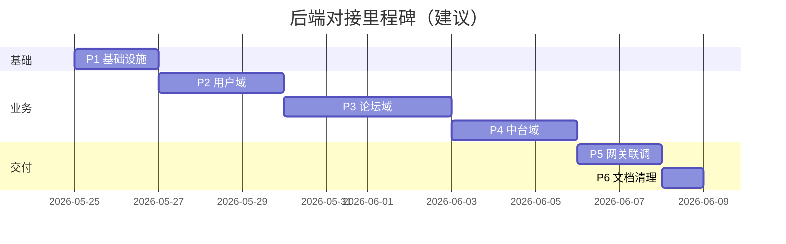

# 后端框架对接实施计划

> **参考仓库**：`reference/ai-forum-gitee/`  
> **配套文档**：[后端框架分析报告](./backend-framework-analysis-report.md)  
> **主工程 MVP**：`frontend/` + `shared/mock-data/` + 轻量/演示型 `services/`  
> **原则**：参考仓库只读；主工程按阶段演进，**不一次性替换**整套后端。

---

## 1. 目标与范围

### 1.1 目标

- 以 Gitee 框架为 **目标架构蓝图**，逐步将主工程从 JSON Mock 演进到 **PostgreSQL + 三微服务**。
- 保证 **演示可连续**：每个阶段结束后，前端仍能完成既定演示动线（登录 → 浏览 → 发帖 → 中台审核）。
- 控制范围：优先 **学院 MVP 演示路径**，不实现需求文档中的远期功能（积分、私信、第三方登录等）。

### 1.2 不在本计划内

- 替换或合并 `reference/ai-forum-gitee/` 到主工程根目录（仅作参考）。
- 重写 Gitee 仓库内前端。
- 生产级安全加固（mTLS、WAF、多副本）——留待上线前专项。

---

## 2. 阶段划分总览

| 阶段 | 名称 | 周期（建议） | 交付物 |
|------|------|--------------|--------|
| P0 | 参考环境与文档基线 | 0.5 天 | 参考目录、分析报告、本计划 ✅ |
| P1 | 基础设施就绪 | 1–2 天 | 本地 Postgres+Redis、Schema 初始化脚本、`.env` 规范 |
| P2 | 用户域对接 | 2–3 天 | 注册/登录/JWT、演示账号种子、前端登录改造 |
| P3 | 论坛域对接 | 3–4 天 | 板块/帖子/评论 API、Mock 数据迁移脚本 |
| P4 | 中台域对接 | 2–3 天 | 审核、配置、敏感词、管理端 API |
| P5 | 网关与联调 | 1–2 天 | Nginx/Vite 代理修正、E2E 演示脚本 |
| P6 | 清理与文档 | 1 天 | 废弃 Mock 路径、更新 README |

**合计建议**：约 10–15 个工作日（1 人兼职可按周翻倍）。

---

## 3. 阶段详细任务

### P0：参考环境与文档基线 ✅

**已完成项**：

- [x] 克隆 Gitee 至 `reference/ai-forum-gitee/`
- [x] 编写《后端框架分析报告》
- [x] 编写本实施计划

**你可执行**：

```powershell
# 仅启动参考仓库基础设施（在 reference 目录外单独起库，避免污染主工程）
docker compose -f reference/ai-forum-gitee/docker-compose.yml up -d postgres redis
# 手动执行 schema 初始化（首次）
# psql -U ai_forum -d ai_forum -f reference/ai-forum-gitee/migrations/init/000_init_schemas.up.sql
```

---

### P1：基础设施就绪

| 任务 ID | 任务 | 产出 | 验收标准 |
|---------|------|------|----------|
| P1-1 | 在主工程 `infra/` 定义 Postgres+Redis（账号与 Gitee 一致） | `infra/docker-compose.yml` | `pg_isready`、 `redis-cli ping` 通过 |
| P1-2 | 将 `000_init_schemas.up.sql` 纳入首次初始化 | `infra/postgres/init/` 或文档化一键脚本 | 三 Schema 存在 |
| P1-3 | 新增 `.env.example` / `.env.local.example`（本地 `127.0.0.1`） | 根目录或 `infra/` | 三服务能连库 |
| P1-4 | **决策**：主工程 `services/` 是「从参考复制」还是「新建分支逐文件迁移」 | ADR 一句话记录进 `docs/` | 团队达成一致 |

**风险**：主工程若已混入参考代码与旧 `cmd/server` 并存，需在本阶段 **选定单一入口**（建议统一为 `cmd/main.go` 或保留 MVP 的 `cmd/server` 二选一，勿双轨）。

---

### P2：用户域对接

| 任务 ID | 任务 | 说明 |
|---------|------|------|
| P2-1 | 引入 user-service 迁移并跑通 | `schema_auth.users` 等 |
| P2-2 | 编写种子脚本：将 `shared/mock-data/users.json` 转为 SQL | 映射：`name→username`，`role`→`level`+`user_roles` |
| P2-3 | 实现 **演示快捷登录**（二选一） | A) 保留 `demo-login` 适配器；B) 种子固定账号+密码文档 |
| P2-4 | 修复 **管理员 JWT**：登录后根据 `user_roles` 写入 `role` claim | 否则中台 API 不可用 |
| P2-5 | 前端 `api.js`：`demoLogin` → `login`，`users/me` 路径对齐 | 可保留 Vite 代理 |

**验收**：学生/管理员账号能拿 JWT，中台路由可识别管理员身份。

---

### P3：论坛域对接

| 任务 ID | 任务 | 说明 |
|---------|------|------|
| P3-1 | 跑通 forum 迁移；对齐板块 slug | MVP：`board-study` ↔ 参考 `ai-learning` 需映射表 |
| P3-2 | 导入 `posts.json`、`comments.json` | 维护 `old_id → new_id` 映射表 |
| P3-3 | 适配 API 字段 | camelCase ↔ snake_case；`boardId` 查询参数 |
| P3-4 | 发帖审核流 | `moderationMode: auto` 时走 `moderation/check` |
| P3-5 | 附件 | MVP 内嵌附件 vs 参考 `attachments` 表，先做只读展示 |

**验收**：三大板块列表、帖子详情、发帖/评论与 MVP 演示一致。

---

### P4：中台域对接

| 任务 ID | 任务 | 说明 |
|---------|------|------|
| P4-1 | 导入 `sensitive-words.json` | 调 admin API 或 SQL seed |
| P4-2 | 迁移 `system-config.json` → `system_config` 键值 | `postingEnabled`、`boardSwitches`、`moderationMode` |
| P4-3 | 审核 UI 对接 | 由 `audit-records.json` 改为「待审帖子列表」API |
| P4-4 | 用户封禁 | `ban` 调 user internal API |
| P4-5 | 统计概览 | `/api/v1/admin/stats/overview` 替换 mock 统计 |

**验收**：管理员完成审核通过/驳回、封禁、配置开关、概览数据展示。

---

### P5：网关与联调

| 任务 ID | 任务 | 说明 |
|---------|------|------|
| P5-1 | 修正 Nginx：增加 `/api/v1/register`、`/api/v1/login`、`/api/v1/users` | 参考 `reference/ai-forum-gitee/nginx/nginx.conf` |
| P5-2 | 统一开发代理 | `vite.config.js` 与生产网关路径一致 |
| P5-3 | 编写 `scripts/smoke-test.ps1` | health + 登录 + 拉帖 + 审核一条 |
| P5-4 | 更新 `start-dev.ps1` | 先起 infra，再起三服务（各设 `DB_SCHEMA`） |

**验收**：仅通过 `http://localhost`（或统一 dev 端口）完成全流程，无需记三个端口。

---

### P6：清理与文档

| 任务 ID | 任务 |
|---------|------|
| P6-1 | 标记废弃：`shared/mock-data` 运行时写入（若已切 DB） |
| P6-2 | 删除重复入口 `cmd/server`（若已迁移） |
| P6-3 | 更新根 `README.md`：启动顺序、环境变量、演示账号 |
| P6-4 | 可选：保留 `frontend-standalone` 纯 Mock，与联调版分离 |

---

## 4. API 适配策略（推荐）

为避免前端大面积重写，建议主工程增加 **薄适配层**（任选其一）：

| 方案 | 做法 | 优点 | 缺点 |
|------|------|------|------|
| **A. BFF 网关** | 单 Go `gateway` 将 MVP 路径转调三服务 | 前端改动最小 | 多一个服务 |
| **B. 前端改契约** | 直接按 Gitee API 改 `api.js` | 架构最干净 | 前端改动集中 |
| **C. 演示模式双轨** | `VITE_USE_MOCK=true` 时走 JSON | 演示稳定 | 长期维护两套 |

**建议**：短期 **C + 逐步 B**；学院答辩前保证 Mock 轨可用，联调轨用于「真实后端」展示。

---

## 5. 数据迁移清单

| Mock 文件 | 目标 | 迁移方式 |
|-----------|------|----------|
| `users.json` | `schema_auth.users` + `user_roles` | SQL seed |
| `boards.json` | `schema_forum.boards` | slug 映射后 INSERT |
| `posts.json` | `schema_forum.posts` | 批量 INSERT + ID 映射 |
| `comments.json` | `schema_forum.comments` | 依赖 post ID 映射 |
| `sensitive-words.json` | `schema_admin.sensitive_words` | seed |
| `system-config.json` | `schema_admin.system_config` | 键值展开 |
| `audit-records.json` | 帖子 `status` | 逻辑转换，非 1:1 表 |

---

## 6. 风险登记

| 风险 | 影响 | 缓解措施 |
|------|------|----------|
| 主工程已部分合并参考代码 | 双入口、行为不一致 | P1 明确只保留一套 `services` |
| 管理员无法进中台 | 演示失败 | P2 优先修 JWT role |
| Nginx 漏路由 | 登录 404 | P5 或开发期直连 8001 |
| ID 类型变化 | 前端路由/链接失效 | 迁移映射表 + 短期兼容字符串 ID 查询 |
| 工期超预期 | 延期 | 保持 Mock 轨至 P5 完成 |

---

## 7. 里程碑与检查点



**阶段评审问题（每阶段结束前回答）**：

1. 演示动线是否仍可走通？  
2. 是否引入了不可回滚的破坏性变更？  
3. `reference/ai-forum-gitee` 是否仍与主工程解耦？

---

## 8. 下一步行动（待你确认）

请从下列选项中勾选优先级（可直接回复编号）：

1. **仅维护参考目录 + 文档**（当前状态，不改主工程 `services/`）  
2. **执行 P1**：只搭 Postgres/Redis 与 Schema，不动业务代码  
3. **执行 P2**：开始用户域与登录对接  
4. **回滚主工程**：若此前误合并了整套参考后端，恢复 MVP 单文件服务  

---

## 9. 相关路径速查

| 资源 | 路径 |
|------|------|
| Gitee 参考克隆 | `reference/ai-forum-gitee/` |
| 参考说明 | `reference/README.md` |
| 分析报告 | `docs/backend-framework-analysis-report.md` |
| 本计划 | `docs/backend-framework-integration-plan.md` |
| 主工程 Mock 数据 | `shared/mock-data/` |
| 主工程前端 API | `frontend/src/api.js` |
