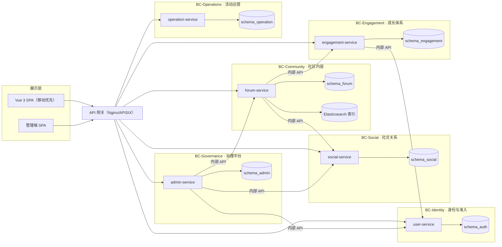

# AI 智联论坛 · 最终形态设计蓝图

> 版本：v1.0（2026-08-17）
> 定位：从零设计的**最终形态**完整蓝图，不受现有 MVP / Discourse 方案束缚。
> 用途：作为后续产品迭代、架构开发、验收的单一权威依据；开发时按本文档拆 Ticket。
> 状态：**草案待评审** —— 文末第 12 节的关键决策点需用户拍板后冻结。

---

## 1. 产品定位

### 1.1 一句话定位

**面向学院师生的 AI 主题社区：让 AI 学习、实践、协作、活动在一个平台内形成闭环。**

### 1.2 核心价值主张

| 价值 | 说明 |
|------|------|
| 内容价值 | 高质量 AI 讨论与知识沉淀：教程、问答、项目、资源、经验帖 |
| 组织价值 | 协会运营数字化：活动、赛事、招新、公示、审核全线上 |
| 生态价值 | 学生成长可视化：积分、等级、徽章、作品集，形成「学习 → 实践 → 展示」链路 |

### 1.3 系统边界

- **做**：社区内容、身份认证、社交关系、成长体系、运营治理、活动赛事、统计报表
- **不做（v1 明确排除）**：实时音视频会议、即时聊天 IM 主场景、在线课程直播教学、支付交易
- 私信、通知、圈子属于站内轻社交；IM 深度能力（音视频/群聊大文件）留作远期独立演进

### 1.4 设计原则

1. **移动端优先**：手机窄屏为第一验收标准，桌面为增强
2. **内容即服务**：搜索、推荐、通知驱动内容发现，不依赖传统楼层式浏览
3. **治理前置**：审核流、敏感词、举报闭环在设计期内置，而非事后补丁
4. **限界上下文隔离**：服务间只走内部 API，不跨 Schema 直连
5. **可运营可审计**：一切治理操作留痕，统计报表开箱即用
6. **成长体系克制**：积分/等级/徽章服务用户留存，但不喧宾夺主、不搞攀比压迫感

---

## 2. 目标用户与角色体系

### 2.1 用户角色

| 角色 | 说明 | 核心诉求 |
|------|------|----------|
| 访客 | 未登录用户 | 浏览公开内容，被吸引注册 |
| 学生 | 在校生（默认角色） | 学习、问答、互动、参加活动、展示自己 |
| 社团成员/创作者 | 协会骨干、优质内容贡献者 | 影响力、积分、运营支持 |
| 社团管理员（admin） | 协会运营人员 | 审核内容、管理用户、发布活动、看数据 |
| 平台管理员（platform_admin） | 系统运维/总负责 | 全站配置、风控、角色分配、审计 |
| 指导老师 | 教师/指导教师 | 把关优质内容、背书推荐、观察学生表现 |

### 2.2 权限模型

- **RBAC + 资源级权限**：角色 → 权限点（`post.create`、`audit.approve`、`user.ban` …）→ 资源范围
- 权限点覆盖：内容（发帖/回帖/删帖/置顶/精华/锁定）、用户（封禁/等级/角色）、板块（管理/审核模式）、运营（活动/赛事/公告）、平台（配置/邀请码/审计）
- 敏感操作（封禁、删帖、改角色）必须写审计日志并支持「谁在何时做了什么」

---

## 3. 功能全景

功能按六层组织，每层对应一个限界上下文（见第 6 节）。

### 3.1 社区内容层（BC-Community）

**板块系统**
- 多级分类：父板块 / 子板块，树形展示；板块可设图标、封面、描述、排序
- 板块权限：按角色控制「可浏览 / 可发帖 / 可回帖 / 仅管理员」；板块可独立开启审核模式

**帖子**
- 富文本 + Markdown 双编辑；支持标签（tags）、投票（poll）、附件上传、@提及
- 帖子状态机：`draft → pending_review → published ⇄ rejected | deleted | hidden | archived | locked`
- 运营能力：置顶、精华、加锁、归档、移动到其他板块、合并/拆分（远期）

**评论**
- 树状嵌套评论（无限层级可折叠），支持回复通知、评论点赞、只看楼主
- 评论同样可进审核队列、可举报

**互动**
- 点赞 / 收藏 / 分享（复制链接 + 生成海报）
- 计数全部基于事实表实时汇总，杜绝计数器漂移

**搜索与发现**
- 全文检索：标题 / 内容 / 标签 / 作者 / 板块，支持高亮与分面筛选（时间、板块、类型、热度）
- 内容流：热门 / 最新 / 精华 / 关注 / 板块 Tab；无限滚动；URL 可分享排序状态

### 3.2 身份与用户层（BC-Identity）

**账号体系**
- 注册：邮箱 / 手机号 + 密码；OAuth：QQ、微信、GitHub（可开关）
- 支持对接学校统一认证（SSO / CAS / OIDC），学生一次登录进入社区
- 邀请码准入（平台级开关：关闭后开放注册）

**资料**
- 昵称、头像、个性签名、院系专业、年级、入学年份、个人主页
- 个人主页聚合：帖子、评论、收藏、关注、成就徽章、作品集

**成长体系（BC-Engagement）**
- 积分：发帖/被赞/回答被采纳/活动参与/连续签到等赚取，规则可配置
- 等级：由积分驱动，解锁能力（附件大小、每日发帖上限、自定义头衔）
- 徽章：成就制（首帖、百日签到、精华作者、赛事获奖…）
- 任务：每日签到、新手指引任务，任务中心化展示进度

### 3.3 社交关系层（BC-Social）

- **关注系统**：关注用户、关注板块、关注话题；生成「关注动态流」
- **私信**：一对一私信，含未读数、已读回执；群聊为远期能力
- **通知中心**：回复、@、点赞、收藏、关注、私信、审核结果、系统公告
  - 通道：站内信（默认）+ 邮件（可选）+ 微信/邮件推送（远期）
  - 通知可批量已读、可跳转来源页
- **圈子 / 小组（社团空间）**：社团主页、成员管理、圈内公告、圈内活动、权限可控

### 3.4 协作与活动层（BC-Operations）

- **活动**：活动发布（时间/地点/报名上限）、报名、签到、反馈问卷、参与数据统计
- **赛事专区**：赛题发布、组队、作品提交、评审打分、排名公示
- **问答模块**：问题帖 + 回答 + 采纳最佳答案，形成「已解决」状态，沉淀知识库
- **项目 / 作品集**：项目展示页、GitHub 关联、开源协作引导、毕业/求职作品集

### 3.5 治理中台（BC-Governance）

**内容治理**
- 审核队列：按板块/时间/类型筛选，通过 / 驳回（必填理由）/ 删帖 / 隐藏，支持批量
- 申诉中心：被驳回/被删可申诉，管理员复核闭环
- 敏感词：词库（精确/正则/变体），命中策略（拦截 / 转待审 / 替换），支持分板块策略
- 举报中心：举报受理 → 核查 → 处理 → 反馈举报人

**用户治理**
- 用户列表（搜索/筛选）、封禁 / 解封（含时长）、等级调整、角色分配
- 用户操作日志：登录、发帖、被处罚等时间线

**运营工具**
- 置顶、精华、公告、首页 Banner 位管理
- 板块管理：CRUD、权限、审核模式、归档

**数据统计**
- 概览大屏：DAU/MAU、新增用户、发帖量、活跃板块 Top
- 趋势分析：帖子/用户/互动按日周月趋势
- 转化漏斗：访客 → 注册 → 首帖 → 活跃
- 报表导出（CSV / Excel）

### 3.6 平台层（BC-Platform）

- 系统配置：注册开关、发帖开关、全局审核模式、站点公告、积分规则
- 邀请码：生成 / 作废 / 用量追踪 / 关联用户
- RBAC 管理：角色、权限点、用户-角色绑定
- 审计日志：全量治理操作留痕，支持检索
- 风控：登录/接口限流、异常行为检测（灌水、撞库）、IP/设备黑名单

---

## 4. 信息架构

### 4.1 学生端主导航（移动端底部 Tab）

```
首页(动态流)  板块  问答  活动  圈子  消息  我的
```

- **首页**：关注流 / 推荐流 / 热门 / 最新 / 精华 多 Tab
- **板块**：树形板块列表 + 板块页（帖子流 + 板块信息 + 发帖入口）
- **问答**：问题列表、未解决/已解决筛选、采纳状态
- **活动**：进行中 / 报名中 / 已结束
- **圈子**：我的社团 / 推荐社团 / 圈子主页
- **消息**：通知中心 + 私信入口（未读红点）
- **我的**：资料编辑、主页、收藏、关注、等级积分徽章、设置

### 4.2 管理端导航

```
概览  内容  审核  用户  板块  活动/赛事  统计  配置
```

- **概览**：数据卡片 + 趋势图 + 待办（待审核数、待处理举报）
- **内容**：全站帖子/评论列表（搜索/筛选/运营操作）
- **审核**：队列 + 敏感词 + 举报中心 + 申诉中心
- **用户**：列表 + 详情（资料/行为/处罚）+ 封禁/角色/等级
- **板块**：板块树管理 + 权限配置
- **活动/赛事**：活动管理 + 赛事管理 + 报名数据
- **统计**：概览、趋势、漏斗、导出
- **配置**：系统配置、邀请码、角色权限、审计日志

---

## 5. 领域模型：限界上下文与聚合



### 5.1 各上下文职责与聚合

| 上下文 | 服务 | 聚合 | 数据主权 |
|--------|------|------|----------|
| BC-Identity | user-service | User、Session、InviteCode | `schema_auth` |
| BC-Community | forum-service | Board、Post、Comment、Attachment、Tag、Poll | `schema_forum` |
| BC-Social | social-service | Follow、PrivateMessage、Notification、Circle（圈子） | `schema_social` |
| BC-Engagement | engagement-service | Point、Level、Badge、Task、SignIn | `schema_engagement` |
| BC-Governance | admin-service | AuditRecord、SensitiveWord、Report、UserBan、Role、OperationLog | `schema_admin` |
| BC-Operations | operation-service | Activity、ActivitySignup、Contest、Submission、Review | `schema_operation` |

### 5.2 集成规则

- 服务间数据访问一律走内部 API（`/internal/v1`），**禁止跨 Schema 直连**
- 治理中台对内容/用户的操作通过 ACL 调用对应服务；被调服务是数据所有者，负责校验与落库
- 事件驱动：跨上下文状态变更（发帖、被赞、审核通过）通过消息队列广播，由各上下文消费生成自己的读模型（如通知、计数、搜索索引）
- 网关承载：JWT 校验、路由、限流、灰度（远期）

---

## 6. 技术架构建议

### 6.1 技术选型

| 层 | 选型 | 说明 |
|----|------|------|
| 前端 | Vue 3 + Vite + Tailwind（移动优先 SPA）；管理端独立 SPA | 沿用团队已掌握的栈 |
| 后端 | Go 1.23+ / Gin，按 BC 拆分微服务 | 与现有 user/admin 服务一致 |
| 数据库 | PostgreSQL 16，每上下文独立 Schema | 事务强一致，成熟 |
| 缓存/会话 | Redis 7 | Token 黑名单、限流、热点计数 |
| 搜索 | Elasticsearch 8（或 Meilisearch 轻量起步） | 全文检索 + 分面；v1 可先 PG tsvector 过渡 |
| 对象存储 | MinIO（自建）或云 OSS | 附件/头像/海报 |
| 消息队列 | Redis Stream（起步）/ RabbitMQ（演进） | 通知、索引、计数的事件总线 |
| 网关 | Nginx（现状）→ APISIX（远期） | 统一路由、限流、可观测 |
| 部署 | Docker Compose → 单机 → 云 K8s 演进 | 阶段按规模决定 |
| 可观测 | Prometheus + Grafana + Loki | 指标、日志、链路 |

### 6.2 关键决策点（见第 12 节）

- 内容引擎**自研**（forum-service）还是**复用现成论坛**（Discourse/Flarum/NodeBB）
- 微服务按 BC 全拆，还是**模块化单体起步、按需拆分**（推荐先单体后拆分，避免前期分布式复杂度）
- 搜索方案选型与演进路径

---

## 7. 数据模型（核心表）

> 只列骨架，具体字段与迁移在开发阶段细化。所有表带 `id`（uuid/bigserial）、`created_at`、`updated_at`，软删除用 `deleted_at`。

### 7.1 schema_auth（身份）

```text
users            id, username, email, phone, password_hash, avatar, profile(JSONB),
                 role, department, major, grade, status(active/banned/disabled),
                 last_login_at, created_at
sessions         id, user_id, refresh_token_hash, expires_at, revoked_at
invite_codes     id, code, created_by, used_by, used_at, status, remark
user_roles       user_id, role, granted_by, created_at
```

### 7.2 schema_forum（社区内容）

```text
boards           id, parent_id, slug, name, description, icon, cover,
                 sort_order, status, post_permission, moderation_mode
posts            id, board_id, author_id, title, content, content_format,
                 tags[], status(draft/pending_review/published/rejected/deleted/
                              hidden/archived/locked),
                 is_pinned, is_featured, vote_count, comment_count,
                 view_count, review_reason, published_at, deleted_at
post_votes       post_id, user_id, value(1/-1), created_at
post_likes       post_id, user_id, created_at
collections      post_id, user_id, created_at
comments         id, post_id, parent_id, author_id, content, status,
                 like_count, review_reason, created_at
attachments      id, owner_type, owner_id, file_key, file_name, size,
                 mime, checksum, uploader_id, created_at
tags             id, name, slug, post_count
posts_tags       post_id, tag_id
```

### 7.3 schema_social（社交关系）

```text
follows          id, follower_id, followee_type(user/board/tag), followee_id, created_at
private_messages id, sender_id, recipient_id, content, is_read, read_at, created_at
notifications    id, user_id, type, actor_id, target_type, target_id,
                 content, is_read, created_at
circles          id, name, description, owner_id, icon, status, member_policy
circle_members   circle_id, user_id, role, joined_at
```

### 7.4 schema_engagement（成长体系）

```text
point_rules      id, code, name, points, enabled, remark
point_records    id, user_id, rule_code, points, target_type, target_id,
                 balance_after, created_at
user_levels      id, user_id, level, points_total, updated_at
badges           id, code, name, description, icon, condition_type, condition_json
user_badges      user_id, badge_id, earned_at
sign_ins         id, user_id, sign_date, streak_days, points
daily_tasks      id, code, name, description, reward_points, enabled
user_tasks       user_id, task_code, status, progress, completed_at
```

### 7.5 schema_admin（治理中台）

```text
audit_records    id, target_type(post/comment), target_id, status, reason,
                 reviewer_id, reviewed_at, created_at
sensitive_words  id, word, match_type(exact/regex/variant), action(block/review/replace),
                 replace_with, board_scope, enabled
reports          id, target_type, target_id, reporter_id, reason, status,
                 handler_id, handled_at, feedback
bans             id, user_id, reason, banned_by, starts_at, expires_at, status
operation_logs   id, actor_id, action, target_type, target_id, detail(JSONB), created_at
roles            id, code, name, description
permissions      id, code, name, description
role_permissions role_id, permission_id
```

### 7.6 schema_operation（活动运营）

```text
activities       id, title, description, cover, location, starts_at, ends_at,
                 signup_deadline, signup_limit, status, publisher_id
activity_signups id, activity_id, user_id, status, checked_in_at, created_at
contests         id, title, description, rules, starts_at, ends_at, status, organizer_id
contest_teams    id, contest_id, name, leader_id, status
contest_submissions id, contest_id, team_id, title, content, files[], submitted_at
reviews          id, submission_id, reviewer_id, score, comment, created_at
question_answers id, question_post_id, answer_post_id, is_accepted
```

---

## 8. 治理与安全体系

### 8.1 内容治理链路

```
发帖/评论 → 敏感词检测 → 命中？→ 拦截/替换
            ↓ 未命中
        板块审核模式？→ 是 → pending_review → 审核队列 → 通过/驳回/删帖
            ↓ 否
        published → 用户举报 → 举报中心 → 处理 → 反馈
```

- 审核模式支持：全局默认、按板块覆盖、按用户等级豁免（高级用户免审）
- 被驳回/被删必须能申诉，申诉进入独立队列

### 8.2 安全基线

- 认证：JWT（access + refresh），refresh 存哈希，支持吊销
- 传输：全站 HTTPS；登录/注册接口限流防爆破
- 权限：中间件统一做 JWT 解析 + RBAC 校验；所有治理接口二次校验资源归属
- 输入：参数化 SQL、富文本 XSS 消毒、附件白名单 + 病毒扫描（远期）
- 隐私：遵循最小收集；用户注销/数据导出接口；操作日志脱敏
- 数据：定时备份 + 恢复演练；生产库禁止共享超级用户

### 8.3 审计

- 治理操作（封禁/删帖/改角色/改配置）全量写 `operation_logs`
- 登录、敏感操作支持回溯；报表可导出

---

## 9. 非功能需求

| 维度 | 要求 |
|------|------|
| 性能 | 列表接口 P95 < 300ms；搜索 P95 < 500ms；热点内容走缓存 |
| 容量 | 目标支撑万级注册用户、千级日活、十万级帖子量级 |
| 可用性 | 关键路径（登录/读帖）可用性 ≥ 99.5%；附件走对象存储减轻 DB 压力 |
| 可扩展 | 读多写少场景（列表/计数）读缓存 + 异步写；服务无状态可水平扩展 |
| 可观测 | 全链路日志（trace_id）、Prometheus 指标、Grafana 大盘、告警 |
| 可维护 | 迁移脚本 up/down 成对；接口契约集中维护；服务间只认内部 API |

---

## 10. 分期实施路线（从零到最终形态）

| 阶段 | 目标 | 核心交付 | 退出标准 |
|------|------|----------|----------|
| P0 设计冻结 | 蓝图评审、决策点拍板 | 本文档定稿 + 数据模型细化 + API 契约 v1 | 关键决策点已确认 |
| P1 内容与身份 | 可试运行的论坛闭环 | 注册/登录/SSO、板块、发帖/评论/点赞/收藏、基础搜索、管理端内容治理 | 学生可发帖、管理员可审核，全流程走通 |
| P2 社交与成长 | 留存与互动 | 关注/动态流、通知中心、私信、积分/等级/徽章/签到 | 日活与互动指标可观测 |
| P3 治理与运营 | 合规与运营工具 | 审核队列增强、举报/申诉、敏感词策略、活动/赛事/问答、统计报表 | 运营全流程线上化 |
| P4 平台与规模化 | 稳健与扩展 | 圈子/项目、搜索升级 ES、对象存储、审计/风控增强、K8s、可观测体系 | 达到非功能需求基线 |

> 每阶段验收必须包含移动端窄屏检查；每 Ticket 一个 commit，串行推进（遵循仓库 AGENTS.md 交付纪律）。

---

## 11. 成功标准（最终形态长什么样）

1. 学生用手机 3 分钟完成「注册 → 进首页 → 找到感兴趣话题 → 发帖/回帖」
2. 协会运营在管理端完成「审帖 → 置顶精华 → 发活动 → 看数据」全流程，不需要开发介入
3. 平台管理员可配置注册/审核/敏感词策略，所有治理操作可审计回溯
4. 站内通知、关注流、成长体系让用户「来了想再来」
5. 架构上每个上下文可独立演进、扩容，不出现跨库直连和重复造轮子

---

## 12. 关键决策点（待用户拍板）

| # | 决策点 | 选项 | 影响 |
|---|--------|------|------|
| D1 | 内容引擎 | A. 自研 forum-service（可控、贴合业务，成本高）<br/>B. 复用 Discourse/Flarum/NodeBB（快、稳，定制受限）<br/>C. 自研 + 兼容迁移（推荐给长期目标） | 决定 BC-Community 全部设计与人力投入 |
| D2 | 后端形态 | A. 微服务按 BC 全拆<br/>B. **模块化单体起步，按需拆分（推荐）** | 影响开发效率与运维复杂度 |
| D3 | 搜索方案 | A. PG 内置全文（v1 够用）<br/>B. 直接上 Elasticsearch/Meilisearch | 影响检索体验与部署成本 |
| D4 | 附件存储 | A. 本地磁盘（起步）<br/>B. MinIO / 云 OSS | 影响备份与容量策略 |
| D5 | 学校 SSO | A. 自建账号 + OAuth（QQ/微信/GitHub）<br/>B. 对接学校统一认证（OIDC/CAS） | 影响注册与登录主流程 |
| D6 | 部署规模 | A. 单机 Docker Compose<br/>B. 云主机多机<br/>C. K8s | 影响基础设施投入 |
