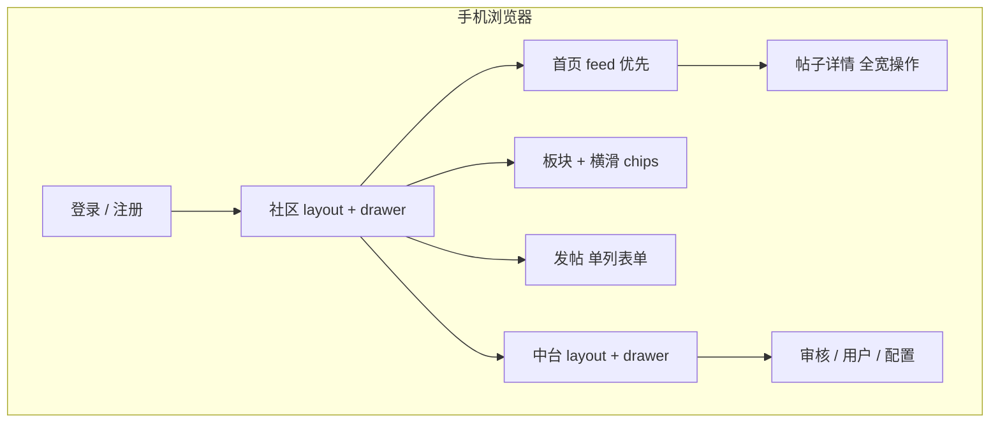

# AI 智联论坛 — 手机网页版适配计划书

> **审视视角**：Chris Coyier（CodePen / CSS-Tricks）— 用 CSS 把体验做对，用真机把假设打碎，demo 要能站得住。  
> **项目基线**：`release/forum-v1` · 学院 Vue 3 前端 · 单文件 `style.css` 已含 mobile-first + drawer + `safe-area` + `100dvh`  
> **本文性质**：**仅计划，不写代码**（下一阶段测试前的设计蓝图）  
> **日期**：2026-05-24

---

## 0. 一句话结论（Coyier 式）

你们**不是从零做 H5**——窄屏骨架已经在 `style.css` 里：抽屉导航、`minmax(0, 1fr)` 防溢出、`board-strip` 横滑、`@media (min-width: 768px/1024px)` 做增强。  
下一阶段要做的，是**在真实手机浏览器里把「能打开」变成「愿意用」**：触控、表单、中台密度、键盘与安全区，以及每条用户路径上的 **CSS 小把戏** 是否经得起 Safari / 微信内置浏览器。

---

## 1. Coyier 会怎么定义「手机网页版」

| 概念 | 在本项目的含义 |
|------|----------------|
| **不是原生 App** | 不引入 Capacitor / 小程序；就是 `https://` + 响应式 CSS + 可选 PWA 增强 |
| **Mobile Web ≠ 缩小桌面** | 窄屏默认单列、feed 优先、操作区全宽按钮；桌面是 `@media` 里的「加分项」 |
| **CSS 是第一公民** | 优先改 `style.css` 与 markup 结构，不为了适配再上 UI 框架 |
| **Progressive Enhancement** | 无 JS 也能看字；有 JS 才有 drawer、toast、分页「加载更多」 |
| **Demo 要能在真机录屏** | 答辩/测试时，iPhone + Android 各走通一条完整旅程 |

---

## 2. 现状审计（基于 `frontend/` 已有实现）

### 2.1 已经做对的（值得保留，别推翻重来）

| 项 | 位置 / 表现 | Coyier 评价 |
|----|-------------|-------------|
| viewport + 安全区 | `index.html`：`viewport-fit=cover`；`:root` 里 `--safe-*` | ✅ 刘海屏必备 |
| 动态视口高度 | `100dvh` + `100vh` 回退 | ✅ 避免 iOS 地址栏跳动坑 |
| 触控友好基底 | `touch-action: manipulation`、`-webkit-tap-highlight-color: transparent` | ✅ |
| 顶栏 + 抽屉 | `<768px` 固定 topbar；drawer `translateX` + backdrop | ✅ 经典 mobile nav pattern |
| 防横向爆炸 | 大量 `minmax(0, 1fr)`、`overflow-x: hidden` | ✅ Grid/Flex 老坑已防 |
| 板块横滑 | `.board-strip` + 隐藏滚动条 | ✅ 「chip rail」很适合手机 |
| 窄屏按钮全宽 | `.action-row` / `.audit-actions` 子按钮 `width: 100%` | ✅ 拇指友好 |
| 移动优先默认 | 默认单列；768/1024 才多列 / 常驻侧栏 | ✅ 符合 mobile-first |

### 2.2 真机测试时最可能「露馅」的地方（计划重点）

| 风险 | 典型页面 | 原因 |
|------|----------|------|
| **中台信息密度** | `AdminUsers`、`AdminPosts`、`AdminAudit` | 一行多按钮 + 等级输入；窄屏虽已 stack，仍可能挤、误触 |
| **登录/注册表单** | `DemoLogin`、`Register` | iOS 缩放（`font-size < 16px`）、键盘顶起、密码自动填充 |
| **长文阅读** | `PostDetail` | 附件链接、评论区长输入、底部按钮与键盘重叠 |
| **审核批量操作** | `AdminAudit` | checkbox + 三按钮；需明确触控目标尺寸 |
| **抽屉滚动链** | `CommunityLayout` / `AdminLayout` | drawer 内 nav 很长时，与 `body` 滚动锁定的配合 |
| **固定顶栏遮挡** | 全站 | `position: fixed` topbar + 主区 `padding-top` 是否在旋转屏仍对齐 |
| **微信 / 系统浏览器差异** | 全站 | 字体、vh、backdrop-filter、底部安全区 |
| **横屏小高度** | 登录、发帖 | `100dvh` 下 hero + 表单可能一屏塞不下 |

---

## 3. 设计原则（Chris Coyier 风格五条）

### 3.1 「先单列，再炫布局」

- 默认：**一个 primary action 占满宽**（你们已在 `.audit-actions` 等做到）。
- 平板以上再用 `grid-template-areas` 重排首页（`page-stack--browse` 已在 768px 启用）——**不要在手机上复制桌面三栏**。

### 3.2 「用 CSS 变量当调参台，别魔法数字满天飞」

建议在实施阶段扩展 `:root`（计划项，非本次修改）：

```css
/* 示意：实施时集中管理触控与间距 */
--tap-min: 44px;           /* Apple HIG 友好值 */
--space-page: 16px;
--space-card: 14px;
--topbar-h: 56px;
--drawer-w: min(88vw, 320px);
```

Coyier 会强调：**改一处，全站按钮/顶栏一起变**，方便 A/B 真机调间距。

### 3.3 「溢出是 bug，不是 feature」

- 任何横向滚动只允许出现在 **刻意设计** 的区域（如 `.board-strip`）。
- 全局禁止「无意横向拖动感」——测试时用 DevTools + 真机边缘滑动检查。

### 3.4 「表单是移动端的地狱入口」

- 输入框 `font-size` ≥ 16px（防 iOS 自动放大）。
- 合理使用 `autocomplete`、`inputmode`、`enterkeyhint`（实施阶段改模板）。
- 提交按钮在键盘弹出时仍可达（考虑 `scroll-margin-bottom` 或短表单布局）。

### 3.5 「动画要短、要可关」

- drawer `0.24s ease` 已合理；尊重 `prefers-reduced-motion`（计划新增一条 media）。

---

## 4. 信息架构：手机上的导航故事



**Coyier 建议的默认着陆：**

| 角色 | 登录后首屏 | 理由 |
|------|------------|------|
| 学生 | `/community` feed | 手机 = 刷内容，不是看 hero 文案 |
| 管理员 | `/admin` 概览 metrics | 先扫一眼数字，再进审核 |

（当前逻辑已接近；测试时确认 hero 区块在手机上是否占位过多。）

---

## 5. 分页面适配规格（测试清单的「设计稿」）

### 5.1 登录 / 注册

| 元素 | 手机目标 | 备注 |
|------|----------|------|
| `login-shell` | 单列滚动，hero 可折叠或缩短 | 桌面才两列（1024px） |
| 角色卡片 | 一张卡展开表单时，其余卡不抢高 | `role-card--open` 态需测滚动位置 |
| 主按钮 | min-height ≥ 44px | |
| 注册邀请码 | 数字键盘 `inputmode` | 实施阶段 |

### 5.2 社区首页 `CommunityHome`

| 元素 | 手机目标 |
|------|----------|
| 区块顺序 | **feed → boards chips → featured → hero**（CSS 默认顺序已 feed-first，测 375px 是否仍成立） |
| 「加载更多」 | 全宽 secondary，距底部 safe-area 留白 |
| 帖子卡片 | 标题 2 行 clamp、摘要 3 行 clamp（计划加 line-clamp 工具类） |
| 指标条 | 横滑或 2+1 网格，避免 4 列挤扁 |

### 5.3 板块 `BoardView`

| 元素 | 手机目标 |
|------|----------|
| 发布 CTA | 与列表标题同一 `section-title` 行内换行或下一行全宽 |
| 帖子列表 | 与首页卡片一致 |

### 5.4 帖子详情 `PostDetail`

| 元素 | 手机目标 |
|------|----------|
| 点赞/收藏/编辑 | 全宽或 2 列 grid（当前全宽 stack ✅） |
| 评论框 | `textarea` 最小 4 行；聚焦时不被顶栏盖住 |
| 附件 | 大点击区域（整卡可点） |

### 5.5 发帖 `NewPost` / `EditPost`

| 元素 | 手机目标 |
|------|----------|
| `select` / `file` | 原生控件在 iOS 上样式统一 |
| 附件区 | Lv.2 提示在附件控件 **上方**（已有机理，测换行） |

### 5.6 中台（管理员生命线）

| 页面 | 手机策略 |
|------|----------|
| `AdminOverview` | metrics 横滑或 2×2 grid；板块活跃度单列 |
| `AdminAudit` | 卡片化每条待审；批量删除放 section 顶 sticky（计划） |
| `AdminUsers` | 每用户一张卡：状态 → 操作 → 等级，**不要**一行塞 4 控件 |
| `AdminPosts` | 分页控件拇指区；帖子操作改为「更多」折叠菜单（计划，减按钮宽度） |
| `AdminBoards` | 行内编辑表单单列（结构已有，测输入框宽度） |
| `AdminConfig` | `toggle-grid` 保持单列 |

---

## 6. 技术实施路线图（仅 CSS + 轻 markup，按 Coyier 优先级）

### Phase M0 — 测试基础设施（1–2 天，无视觉大改）

| 任务 | 产出 |
|------|------|
| 设备矩阵表 | iPhone SE / 14、Android Chrome、微信内置浏览器、iPad 竖屏 |
| 路径脚本 | 学生：登录→刷帖→发帖→评论；管理：审核→驳回→板块编辑 |
| 截图基线 | 375×667、390×844、360×800 三套首屏 |
| Bug 板 | 按「溢出 / 触控 / 表单 / 键盘 / 性能」分类 |

### Phase M1 — 「Touch & Type」基础抛光（3–4 天）

| ID | 内容 | Coyier 标签 |
|----|------|-------------|
| M1-1 | 统一 `--tap-min: 44px` 到按钮、nav-link、board-chip | #Sizing |
| M1-2 | 表单 `font-size: 16px` + `line-height` | #iOSZoom |
| M1-3 | `prefers-reduced-motion` 关闭 drawer 动画 | #A11y |
| M1-4 | drawer 打开时 `body { overflow: hidden }`（composable 层） | #ScrollLock |
| M1-5 | `:focus-visible` 轮廓（键盘用户） | #A11y |

### Phase M2 — 「Layout Tricks」页面级（4–5 天）

| ID | 内容 |
|----|------|
| M2-1 | 帖子/用户列表：标题与 meta 的 `-webkit-line-clamp` |
| M2-2 | `AdminUsers` / `AdminPosts`：窄屏「操作区」改 card footer 布局 |
| M2-3 | `AdminAudit`：批量栏 `position: sticky` + `top: calc(topbar + safe)` |
| M2-4 | `PostDetail`：评论表单 `scroll-margin-bottom` |
| M2-5 | 登录页：`<768px` 隐藏或折叠 `metric-row` 三列（减首屏高度） |

### Phase M3 — 「Polish & SVG」观感（2–3 天，可选但 Coyier 会喜欢）

| ID | 内容 |
|----|------|
| M3-1 | 菜单按钮改 inline SVG（汉堡/关闭），替代纯文字「菜单」 |
| M3-2 | 空状态小插图（SVG，<2KB） |
| M3-3 | `theme-color` 与顶栏背景一致，Android 状态栏融合 |
| M3-4 | 轻量 `:active` 缩放反馈（`transform: scale(0.98)`，非必须） |

### Phase M4 — 「Enhancement」可选（不阻塞测试）

| ID | 内容 |
|----|------|
| M4-1 | `manifest.webmanifest` + 添加到主屏幕（仍非 App） |
| M4-2 | `@container` 让 `.post-card` 在宽卡片内变两列 meta（现代浏览器） |
| M4-3 | 暗色模式 `prefers-color-scheme`（学院 demo 可延后） |

---

## 7. 测试计划（下一阶段的核心）

### 7.1 浏览器 / WebView 矩阵

| 环境 | 优先级 | 关注点 |
|------|--------|--------|
| iOS Safari | P0 | vh、键盘、fixed、滚动 |
| Android Chrome | P0 | 字体、按钮样式 |
| 微信内置浏览器 | P1 | 登录回调、底部栏、分享链接打开 |
| iPad Safari 竖屏 | P2 | 768–1023 区间是否「像平板又像手机」 |

### 7.2 每条旅程的「通过标准」（Definition of Done）

| # | 旅程 | 手机通过标准 |
|---|------|----------------|
| 1 | 打开 `http://107.172.138.10/` | 3s 内可交互；无横向滚动 |
| 2 | 学生登录 | 无需缩放即可输入；键盘不挡「确认登录」 |
| 3 | 刷首页 + 加载更多 | 拇指可点；加载态有反馈 |
| 4 | 进帖点赞评论 | 操作后 toast 可见；评论发送后列表更新 |
| 5 | 发帖（无附件） | 单屏可完成主字段 |
| 6 | 管理员审核驳回 | 可输入理由；按钮无误触 |
| 7 | 板块编辑保存 | 行内表单不溢出 |
| 8 | 旋转横屏 | 布局不碎、顶栏不遮内容 |

### 7.3 推荐工具（Coyier 会用的那种）

- **Chrome DevTools Device Mode**：快速迭代宽度  
- **真机 + 远程调试**（Safari Web Inspector / `chrome://inspect`）  
- **BrowserStack 或同类**（若学校网络允许）— 补微信 WebView  
- **录屏**：答辩素材；注意显示 safe-area

---

## 8. 实施目录（已创建）

**专用文件夹**：[`mobile-web/`](../mobile-web/) — 样式分包 + `useBodyScrollLock` + 测试清单；由 `frontend/src/main.js` 引入。

| 文件 | 预期改动类型 | 是否动 JS |
|------|--------------|-----------|
| `mobile-web/styles/*.css` | M1–M2 窄屏覆盖 | 否 |
| `frontend/src/style.css` | 桌面/共用基线（少改） | 否 |
| `frontend/index.html` | manifest link、apple-touch-icon | 否 |
| `frontend/src/composables/useDrawerNav.js` | body scroll lock | 轻 |
| `frontend/src/views/*.vue` | 语义 class、aria、input 属性 | 轻 |
| `frontend/src/views/AdminUsers.vue` 等 | 中台 markup 结构调整 | 轻 |

**刻意不动**：Go 服务、nginx、API 契约、路由表（除非为手机单独加 landing）。

---

## 9. 与 R1–R3 的关系

| 已有能力 | 手机适配受益 |
|----------|--------------|
| R1 并行加载 | 弱网手机首屏更快 |
| R2 审核/板块/邀请 UI | 需在手机上重新验触控密度 |
| R3 分页「加载更多」 | 比桌面「翻页」更适合手机 |
| `formatApiError` toast | 窄屏下 toast 位置已在 768px 调整，需验 375px |

---

## 10. 不建议做的事（Coyier + 项目现实）

1. **为手机单独做一套 Vue 项目** — 维护成本翻倍，CSS 足够。  
2. **引入 Tailwind / Vant 大包** — 当前单 CSS 文件 18KB 级，保持轻。  
3. **用 `user-scalable=no` 禁缩放** — 损害可访问性；用 16px 字体解决 iOS 缩放。  
4. **所有表格硬塞横滑** — 中台改 card，比 `overflow-x: auto` 表格更体面。  
5. **先做 PWA 再做基础触控** — M4 靠后。

---

## 11. 交付物清单（计划阶段结束后应拥有）

- [ ] 本文档评审通过  
- [ ] 《真机测试记录表》模板（设备 × 旅程 × 通过/失败）  
- [ ] 375 / 390 / 360 三套截图基线目录  
- [ ] Phase M1–M2 的 issue 列表（可映射 GitHub Issues）  
- [ ] 实施 PR 描述：「Mobile Web — Coyier pass」

---

## 12. 相关文档

- [r1-r3-execution-plan.md](./r1-r3-execution-plan.md) — 功能闭环基线  
- [rich-harris-fullstack-audit-plan.md](./rich-harris-fullstack-audit-plan.md) — 数据加载视角  
- [frontend-ui-role-recovery-plan.md](./frontend-ui-role-recovery-plan.md) — 学院 UI 与角色流  

---

*视角：Chris Coyier — 「The best frontend is the one that works in the browser people actually have in their pocket.」*  
*实施顺序建议：**M0 测 → M1 触控与表单 → M2 中台与列表 → M3 抛光**。*
