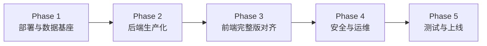

# AI 智联论坛：从 MVP 展示到实际上线 — 实施计划书

> **编制目的**：对照「campus-forum MVP」与「services/ 完整版（ai-forum）」差距，给出可评审、可排期的上线路线图。  
> **当前基线**（2026-05）：后端已替换为 Gitee 三微服务源码；前端仍为学院演示 UI + 适配层；**尚未达到可生产上线标准**。  
> **目标**：达到你对比图中的 **ai-forum 完整版** 能力，并补齐生产环境所需的部署、安全、数据与运维项。

---

## 1. 现状与目标差距（对照你的对比图）

### 1.1 已完成（相对 MVP）

| 维度 | campus-forum MVP | 当前主工程 | 完整版目标 |
|------|------------------|------------|------------|
| 后端结构 | 单文件 `main.go` ×3 | ✅ 分层 `handler/service/model` ×3 | ✅ 已对齐 |
| 数据存储 | JSON 文件 | ✅ PostgreSQL + Redis | ✅ 已对齐 |
| 认证 | 内存 Session + 角色切换 | ✅ JWT + 邀请注册（后端） | ✅ 需前端产品化 |
| 容器化 | 无 | ✅ Dockerfile + compose + Nginx | ✅ 需一键化 |
| API 规模 | ~27 路由 | ✅ 70+ Go 源文件 / 完整路由集 | ⚠️ 前端未全量对接 |

### 1.2 未完成（距「实际上线」）

| 类别 | 具体问题 | 影响 |
|------|----------|------|
| **部署体验** | Schema 初始化非自动化；无统一 `init-db` / 健康检查编排 | 上线易踩坑 |
| **数据** | 无生产种子/迁移；旧 `shared/mock-data` 未入库 | 上线后论坛为空 |
| **前端** | 仍依赖 `demo-login`、字段适配层；未用参考版 `frontend` 完整页面 | 功能展示≠产品功能 |
| **功能缺口** | 附件上传、收藏、评论楼中楼、封禁恢复、邀请码管理 UI 等未打通 | 对比图中「完整版」能力未兑现 |
| **安全** | 默认 JWT 密钥、`/internal` 无鉴权、无 HTTPS | 不能公网裸奔 |
| **遗留代码** | `services/*/cmd/server/`、`frontend-standalone` 双轨并存 | 维护混乱 |
| **质量** | 无 E2E/集成测试、无 CI、未做压测与回滚方案 | 上线风险高 |

### 1.3 「完整版」验收定义（上线合格线）

满足以下 **全部** 条件，方可称为「从展示升级为可上线产品」：

1. **一键部署**：`docker compose up` 后 5 分钟内可通过浏览器完成注册/登录（非 demo-login）、浏览板块、发帖、评论、中台审核。  
2. **真实认证**：生产环境关闭或隔离 `demo-login`；用户走邀请码注册 + 密码登录 + Token 刷新。  
3. **数据持久化**：帖子/评论/配置/审核状态落库；重启不丢数据。  
4. **网关统一**：仅暴露 80/443；Nginx 路由覆盖 user/forum/admin 全部对外 API。  
5. **安全基线**：强 JWT、环境变量密钥、HTTPS、内部 API 鉴权或网络隔离文档化。  
6. **可运维**：健康检查、日志、备份、版本发布说明、回滚步骤。  
7. **测试通过**：核心路径自动化测试 + 手工验收清单签字。

---

## 2. 总体策略

**原则**：

- **后端**：以现有 `services/` 为主，对照 `reference/ai-forum-gitee` 查漏，不重复造轮子。  
- **前端**：优先 **合并参考仓库前端能力** 到主工程 `frontend/`，而非长期维护 `api.js` 适配层。  
- **演示与生产分离**：`demo-login` 仅 dev profile；生产 compose 不注册该路由。  
- **每个 Phase 结束可演示**：不破坏学院答辩路径，但并行收敛到真实用户路径。

---

## 3. 分阶段计划（我建议的执行顺序）

### Phase 1：部署与数据基座（约 3–5 天）

**目标**：任何人 clone 后一条命令起全栈，库里有可浏览内容。

| 序号 | 任务 | 交付物 | 我会怎么做 |
|------|------|--------|------------|
| 1.1 | 数据库一键初始化 | `scripts/init-db.ps1` + `scripts/init-db.sh` | Postgres 容器挂载 `migrations/init`；等待 healthy 后执行三服务迁移 |
| 1.2 | Compose 生产 profile | `docker-compose.yml` + `docker-compose.prod.yml` | 区分 dev（暴露 8001–8003）与 prod（仅 Nginx 80/443） |
| 1.3 | 环境变量规范 | `.env.example`、`.env.production.example` | 强制 `JWT_SECRET`、DB 密码、CORS 域名 |
| 1.4 | 业务种子数据 | `scripts/seed/` SQL 或 Go | 3 板块 + 示例帖/评论 + 管理员账号 + 邀请码；可选从 `shared/mock-data` 转换 |
| 1.5 | 清理遗留 | 删除 `services/*/cmd/server/` | 避免误跑旧 MVP 二进制逻辑 |
| 1.6 | 冒烟脚本 | `scripts/smoke-test.ps1` | health → login → list posts → create post |

**Phase 1 完成标志**：新机器执行 `docker compose up -d` + `init-db` 后，浏览器可看到带内容的论坛首页。

---

### Phase 2：后端生产化（约 5–7 天）

**目标**：对齐对比图中完整版 API 行为，去掉「演示专用」依赖。

| 序号 | 任务 | 说明 |
|------|------|------|
| 2.1 | `demo-login` 环境门控 | 仅 `APP_ENV=development` 时注册；生产返回 404 |
| 2.2 | JWT 角色闭环 | 登录/刷新均从 `user_roles` 解析；中台 API 实测 admin/platform_admin |
| 2.3 | 内部 API 安全 | `/internal/v1` 增加 `X-Internal-Token` 或 mTLS 方案（二选一，文档化） |
| 2.4 | 用户域补全 | 封禁/解封、邀请码 CRUD、操作日志查询 — 与 admin 前端路由对齐 |
| 2.5 | 论坛域补全 | 附件上传存储（本地卷或对象存储抽象）、收藏 toggle、评论分页 |
| 2.6 | 中台域补全 | 敏感词 CRUD、板块 CRUD、批量审核、统计日报落库 |
| 2.7 | Nginx 路由审计 | 对照三服务 `cmd/main.go` 逐条核对 `nginx.conf`，零遗漏 |
| 2.8 | 跨 Schema 策略 | 文档明确 forum JOIN `schema_auth` 的边界；后续是否拆服务列入 backlog |

**Phase 2 完成标志**：用 Postman/冒烟脚本覆盖对比图中「路由数量级」核心路径，无 404/403 误配。

---

### Phase 3：前端完整版对齐（约 7–10 天）

**目标**：前端从「演示适配」升级为「对接完整 API 的产品 UI」。

| 序号 | 任务 | 说明 |
|------|------|------|
| 3.1 | 参考前端 diff | 对比 `reference/ai-forum-gitee/frontend` 与主工程 `frontend` |
| 3.2 | API 层统一 | 引入 `axios` + `api/auth|forum|admin` 模块（参考仓库结构），删除臃肿 `api.js` 适配 |
| 3.3 | 登录/注册页 | 真实 `Login.vue` / `Register.vue`（邀请码）；演示入口改为 dev 开关 |
| 3.4 | 社区页面对齐 | 帖子列表/详情/发帖/附件/点赞收藏 — 字段直接用后端 snake_case 或统一 mapper |
| 3.5 | 中台页面对齐 | 审核、用户、配置、敏感词、统计 — 对接 admin 40+ 路由子集（按 MVP 上线范围裁剪） |
| 3.6 | 权限路由守卫 | 按 JWT `role` + `level` 控制 `/admin` 访问 |
| 3.7 | `frontend-standalone` 定位 | 标注为 offline demo 或归档，避免双维护 |
| 3.8 | 生产构建 | `frontend` 多阶段 Docker build；`VITE_API_BASE_URL` 指向网关 |

**Phase 3 完成标志**：不使用 `demo-login` 也能完成全流程；演示账号仅作为种子用户密码登录。

---

### Phase 4：安全与运维（约 4–6 天）

**目标**：达到可公网部署的最低安全与可恢复性。

| 序号 | 任务 | 交付物 |
|------|------|--------|
| 4.1 | HTTPS | Nginx TLS 配置模板 + Let's Encrypt 说明 |
| 4.2 | 密钥管理 | 禁止默认 `JWT_SECRET`；compose 启动前校验 |
| 4.3 | CORS | 生产仅允许正式前端域名 |
| 4.4 | 限流与防护 | Nginx `limit_req`；发帖/登录频率限制（Redis） |
| 4.5 | 日志 | 结构化日志 + 日志目录卷 |
| 4.6 | 备份 | Postgres 每日 `pg_dump` 脚本 + 恢复演练文档 |
| 4.7 | 监控 | `/health` 聚合检查；可选 Prometheus 占位 |
| 4.8 | 发布 | `DEPLOY.md` 更新：版本号、迁移顺序、回滚 |

---

### Phase 5：测试与上线（约 3–5 天）

| 序号 | 任务 | 说明 |
|------|------|------|
| 5.1 | 集成测试 | 三服务 + DB；关键 API 用 Go test 或 shell |
| 5.2 | E2E | Playwright/Cypress：注册→发帖→审核 |
| 5.3 | 验收清单 | 《上线验收表》与对比图功能逐条勾选 |
| 5.4 | 预发环境 | staging compose + 种子数据 |
| 5.5 | 正式上线 | 生产 compose、域名、备份 cron、值班说明 |

**总工期估算**（1 人全职）：约 **22–33 个工作日**；2 人并行（后端+前端）可压到 **15–20 天**。

---

## 4. 功能对照：对比图 → 计划映射

| 对比图「完整版」能力 | 对应 Phase | 当前状态 |
|--------------------|------------|----------|
| 注册 / 登录 / Token 刷新 | P2 + P3 | 后端有；前端未产品化 |
| 头像上传 | P2 + P3 | 后端有；前端未接 |
| 评论楼中楼 | P2 | 需确认 migrations/API；可能需扩展 |
| 点赞 / 收藏 toggle | P2 + P3 | 后端有；前端仅点赞 |
| 附件管理 | P2 + P3 | 后端有 upload；前端未接 |
| 帖子置顶 / 精华 | P2 + P3 | 中台 API 有；前端未接 |
| 角色权限 / 用户等级 | P2 + P3 | DB + JWT 部分完成 |
| 板块 CRUD | P2 + P3 | 中台有；前端未接 |
| 批量审核 | P2 + P3 | 后端有 batch；前端未接 |
| 邀请码管理 | P2 + P3 | 后端有；前端未接 |
| 操作日志 | P2 + P3 | 后端有；前端未接 |
| 每日统计 | P2 + P3 | 后端有；概览页部分对接 |
| `/health` + Docker | P1 + P4 | 有；需编排与文档 |

---

## 5. 我建议的「接下来 2 周」执行顺序（若你确认按上线推进）

### 第 1 周：能稳定跑起来的「准生产」环境

| 天 | 我的工作 |
|----|----------|
| D1 | `scripts/init-db` + Compose 挂载 Schema 初始化；删除 `cmd/server` 遗留 |
| D2 | 种子数据脚本（板块/帖/评论/管理员/邀请码） |
| D3 | `demo-login` 环境门控 + JWT 角色全链路验证 |
| D4 | Nginx 路由审计 + `smoke-test` |
| D5 | 更新 `README` / `DEPLOY.md`；你本地走通一遍验收 |

### 第 2 周：前端从适配层走向完整版

| 天 | 我的工作 |
|----|----------|
| D6–D7 | 合并参考仓库 `frontend` API 模块与登录/注册页 |
| D8–D9 | 社区主流程（发帖、评论、点赞、附件）对接真实 API |
| D10 | 中台核心页（审核、用户封禁、配置）对接 |
| D11–D12 | HTTPS/密钥/CORS 模板 + 集成测试 |
| D13–D14 | 预发部署 + 验收清单修复 |

---

## 6. 已确认决策（2026-05）

| 项 | 选择 |
|----|------|
| 前端 | **A** — 保留学院 UI，逐步合并参考能力 |
| demo-login | **B** — 内网 / IP 白名单（Nginx + `DemoLoginGuard`） |
| 首版范围 | **核心闭环** |
| 部署 | **Ubuntu 云主机 + 单机 Docker Compose** |

Phase 1 交付：`scripts/init-db.*`、`scripts/seed-content.*`、`docker-compose.prod.yml`、`DEPLOY.md`、`demo-login` 白名单。

---

## 7. 风险与依赖

| 风险 | 缓解 |
|------|------|
| 参考仓库前端与主工程 UI 差异大 | Phase 3 先做 API 层，页面分批替换 |
| forum 跨 schema JOIN | 短期保留；文档标注；长期可拆读模型 |
| 无测试环境 | Phase 1 即引入 staging compose |
| 一人开发周期紧 | 先 Phase 1+2，前端可并行第二人 |

---

## 8. 相关文档

| 文档 | 用途 |
|------|------|
| [backend-framework-analysis-report.md](./backend-framework-analysis-report.md) | 架构与已知缺陷 |
| [backend-framework-integration-plan.md](./backend-framework-integration-plan.md) | 早期对接计划（部分已完成，以本文为准） |
| [reference/ai-forum-gitee/](../reference/ai-forum-gitee/) | 完整版行为参考 |
| 你的对比图 | MVP vs 完整版功能清单 |

---

## 9. 结论（直接回答你的问题）

- **现在**：后端架构已接近对比图中的 **services/ 完整版**；整体项目仍是 **「完整版后端 + 演示型前端 + 未自动化运维」**，**不能**算已上线产品。  
- **按计划完成后**：可达到 **可部署、可注册、可运营** 的学院级论坛第一版；对比图中的远期能力（积分、私信、第三方登录等）仍建议放在 **v1.1+ backlog**。  
- **你确认第 6 节 4 项决策后**，我将从 **Phase 1（init-db + 种子数据 + 清理遗留）** 开始落地，并在每 Phase 结束给你可运行的验收包。

---

*文档版本：v1.0 · 与「MVP 展示 vs ai-forum 完整版」对比图对齐*
