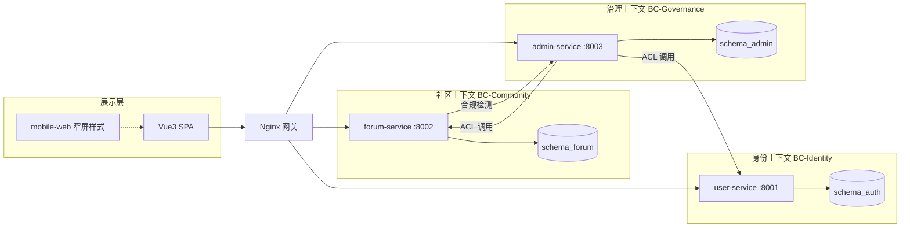

# AI 智联论坛 — 项目介绍与使用指南（领域驱动设计视角）

> **写作视角**：Martin Eriksson 所代表的 DDD 实践 — 先划清**领域与限界上下文**，再谈功能与操作。  
> **读者**：产品、答辩评委、新加入开发者、测试同学。  
> **系统定位**：学院级 AI 社区 MVP — 可演示的「社区 + 最小中台」，非完整企业级产品。

---

## 1. 一句话：这个系统在解决什么问题？

**在学院内部，让 AI 相关话题可以被结构化讨论、运营和治理。**

- **学生**需要：按板块浏览、发帖求助、评论互动、管理个人资料。  
- **协会运营**需要：审核内容、管理用户、置顶/精华、看数据概览。  
- **平台治理**需要：邀请码准入、敏感词、系统配置、角色权限。

技术形态是 **Vue 3 单页应用 + 三个 Go 微服务 + PostgreSQL（三 Schema）+ Redis + Nginx 网关**，用**限界上下文**把上述关切拆开，避免「一个大泥球后端」。

---

## 2. 战略设计：领域、子域与限界上下文

### 2.1 核心域（Core Domain）

| 名称 | 说明 |
|------|------|
| **社区内容域（Community / Forum）** | 板块、帖子、评论、点赞收藏、附件 — 系统的价值中心，用户停留时间最长。 |

### 2.2 支撑子域（Supporting Subdomains）

| 子域 | 说明 |
|------|------|
| **身份与准入（Identity & Access）** | 注册、登录、邀请码、等级、角色 — 没有它社区无法安全运转，但不是差异化卖点。 |
| **运营治理（Operations / Admin）** | 审核、封禁、配置、统计、敏感词 — 支撑合规与运营，遵循「最小中台」边界。 |

### 2.3 通用子域（Generic Subdomain）

| 子域 | 说明 |
|------|------|
| **网关与交付（Gateway / Delivery）** | Nginx 路由、JWT 传递、静态前端 — 可用标准组件，不承载业务规则。 |
| **基础设施（Infrastructure）** | PostgreSQL、Redis、Docker — 技术实现细节。 |

### 2.4 限界上下文地图（Context Map）



**集成关系说明（Eriksson 式「拆不乱」）：**

| 上游 | 下游 | 关系 | 含义 |
|------|------|------|------|
| BC-Governance | BC-Community | **ACL / 开放主机** | 中台通过 `forum` 内部 API 删帖、改板块；对外不暴露内部路径给浏览器。 |
| BC-Governance | BC-Identity | **ACL** | 中台查询/封禁用户、改等级，不直接连 `schema_auth` 表。 |
| BC-Community | BC-Governance | **防腐层** | 发帖/评论可走敏感词与审核策略（配置驱动）。 |
| 展示层 | 三个 BC | **各上下文独立 API 前缀** | `/user-api`、`/forum-api`、`/admin-api` — 边界在网关层可见。 |

---

## 3. 各限界上下文：聚合与职责

### 3.1 BC-Identity（用户服务 `user-service`）

**通用语言**：用户、邀请码、会话、等级、角色（student / admin / platform_admin）

| 聚合（概念） | 职责 |
|--------------|------|
| **User** | 注册、登录、资料、头像、公开主页 |
| **Session** | JWT 签发、refresh、登出语义 |

**对外能力（浏览器可达）**：

- 邀请码注册、用户名密码登录  
- 当前用户资料读写、他人公开资料只读  
- Token 刷新（前端 `api/http.js` 自动处理）

**数据主权**：`schema_auth` — 其它上下文**不得**直连该 Schema。

---

### 3.2 BC-Community（论坛服务 `forum-service`）

**通用语言**：板块（Board）、帖子（Post）、评论（Comment）、互动（Like/Collect）、附件（Attachment）

| 聚合（概念） | 职责 |
|--------------|------|
| **Board** | 板块元数据、slug、启用状态 |
| **Post** | 发帖、编辑、删除（作者）、列表、详情 |
| **Comment** | 帖子下讨论 |
| **Interaction** | 点赞、收藏 |
| **Attachment** | 文件/链接上传与下载 |

**状态机（帖子）**：`published`（公开） / `pending_review`（待审核）等 — 与治理域策略联动。

**对外能力**：

- 浏览板块与帖子流（分页）  
- 发帖、编辑自己的帖、评论、点赞收藏  
- 附件上传（受用户等级等业务规则约束）

**数据主权**：`schema_forum`

---

### 3.3 BC-Governance（中台服务 `admin-service`）

**通用语言**：审核（Audit）、运营配置（Config）、敏感词、邀请码管理、运营统计、RBAC

| 聚合（概念） | 职责 |
|--------------|------|
| **AuditRecord** | 待审列表、通过、驳回（含理由）、批量删除 |
| **SystemConfig** | 发帖开关、审核模式、分板块开关 |
| **Moderation** | 敏感词库维护 |
| **InviteCode** | 生成、作废、状态查询 |
| **UserAdmin** | 列表、封禁/解封、等级、操作日志 |
| **PostAdmin** | 全站帖子、精华、置顶、删除 |
| **BoardAdmin** | 板块 CRUD（委托 Forum ACL） |
| **Role** | 中台角色分配（平台管理员） |
| **Statistics** | 概览、日趋势 |

**对外能力**：仅 **admin / platform_admin** 角色可访问（前端路由守卫 + 后端 JWT）。

**数据主权**：`schema_admin`；对 Forum/User 的修改通过 **应用服务 + HTTP 客户端** 完成，保持上下文独立。

---

## 4. 按角色：你能做什么？（能力清单）

### 4.1 学生（`student`）

| 能力 | 入口 |
|------|------|
| 浏览首页帖子流、按板块筛选 | `/community` |
| 查看帖子、评论、点赞、收藏 | `/community/posts/:id` |
| 发帖、编辑自己的帖 | `/community/posts/new`、`/posts/:id/edit` |
| 个人资料与头像 | `/community/profile` |
| 查看他人主页 | `/community/users/:id` |
| 邀请码注册 | `/register` |

### 4.2 协会管理员（`admin`）

在学生能力基础上，增加：

| 能力 | 入口 |
|------|------|
| 数据概览、板块活跃度 | `/admin` |
| 内容审核（通过/驳回/批量删除） | `/admin/audit` |
| 帖子运营（精华、置顶、删除） | `/admin/posts` |
| 用户封禁、等级、日志 | `/admin/users` |
| 板块管理 | `/admin/boards` |
| 运营配置（发帖开关、审核模式） | `/admin/config` |
| 趋势统计 | `/admin/stats` |

### 4.3 中台管理员（`platform_admin`）

在协会管理员基础上，增加：

| 能力 | 入口 |
|------|------|
| 邀请码生成/作废/状态查询 | `/admin/invites` |
| 敏感词维护 | `/admin/sensitive` |
| 角色权限分配 | `/admin/roles` |

---

## 5. 如何使用（操作指南）

### 5.1 在线演示环境

| 项 | 值 |
|----|-----|
| 地址 | http://107.172.138.10/ |
| 学生账号 | `demo_student` / `demo123456` |
| 协会管理员 | `demo_admin` / `demo123456` |
| 中台管理员 | `demo_platform_admin` / `demo123456` |

**推荐演示路径（答辩用）：**

1. 首页选择「学生用户」→ 输入账号密码 → 进入社区刷帖、打开帖子评论。  
2. 退出 →「协会管理员」登录 → 进入中台 → 审核一条待审内容（可填驳回理由）。  
3. 「中台管理员」登录 → 邀请码 / 敏感词 / 系统配置任选一项展示。

**手机浏览器**：已接入 `mobile-web/` 窄屏样式；Safari / Chrome 打开同上地址，建议横竖屏各试一次抽屉菜单与发帖表单。

---

### 5.2 本地开发（全栈）

**前置**：Docker（Postgres + Redis）、Go 1.23+、Node 20+

```powershell
# 1. 基础设施
docker compose -f infra/docker-compose.yml up -d
# 首次初始化三 Schema（见 README）

# 2. 环境
cp .env.local.example .env

# 3. 一键启动（或分别起三个 Go 服务 + frontend）
.\start-dev.ps1
```

| 入口 | URL |
|------|-----|
| 前端开发服 | http://127.0.0.1:4173/ |
| 用户 API | http://127.0.0.1:8001/api/v1/... |
| 论坛 API | http://127.0.0.1:8002/api/v1/... |
| 中台 API | http://127.0.0.1:8003/api/v1/admin/... |

**Docker 全栈（与线上一致网关前缀）：**

```powershell
cp .env.example .env
docker compose up -d --build
# 访问 http://localhost/
```

> **注意**：前端镜像构建 context 为**仓库根目录**（需同时包含 `frontend/` 与 `mobile-web/`）。见 `docker-compose.yml` 中 `frontend/Dockerfile`。

---

### 5.3 仅前端 Mock（无后端）

目录 `frontend-standalone/`：数据在浏览器 `localStorage`，适合 UI 截图，**不代表真实审核与持久化**。

---

### 5.4 登录与权限（跨上下文规则）

1. 在 **BC-Identity** 登录，获得 JWT。  
2. 前端将 Token 存入 `localStorage`，请求 `/user-api`、`/forum-api`、`/admin-api` 时自动带 `Authorization: Bearer`。  
3. 访问 `/admin/*` 时，前端校验 `role ∈ {admin, platform_admin}`；平台专属菜单仅 `platform_admin`。  
4. Token 过期时，优先走 **refresh**；失败则回登录页。

---

## 6. 仓库结构（与上下文对应）

```text
frontend/              # 展示层：社区 + 中台 UI（唯一部署前端）
mobile-web/            # 展示层：手机窄屏 CSS / 滚动锁（独立目录）
services/user/         # BC-Identity
services/forum/        # BC-Community
services/admin/        # BC-Governance
migrations/init/       # 三 Schema 初始化（数据主权边界）
nginx/                 # 网关：API 前缀路由
shared/api-contract.md # 前后端字段契约（防腐层文档）
docs/                  # 计划书、审视报告、本文档
```

---

## 7. 刻意不做的事（边界声明）

以下能力**不在本 MVP 限界上下文内**，避免 scope 膨胀：

| 不包含 | 原因 |
|--------|------|
| 即时消息 / 私信 | 属于另一协作子域 |
| 全文搜索引擎 | 通用子域，未引入 |
| 支付、积分商城 | 与学院论坛核心无关 |
| 浏览器直连 `/internal/v1/*` | 破坏上下文隔离 |
| 单库单表「大用户表」统管一切 | 违背三 Schema 主权划分 |

---

## 8. 演进建议（仍用 DDD 语言）

| 阶段 | 建议 |
|------|------|
| 短期 | 为三个 BC 补充**上下文映射图**与**集成事件**文档（如「帖子过审」） |
| 中期 | 将 `shared/api-contract.md` 升级为 OpenAPI，作为**防腐层契约**自动生成 |
| 长期 | 高负载时按 Schema **拆库**，Identity / Community / Governance 独立实例 |

---

## 9. 相关文档索引

| 文档 | 内容 |
|------|------|
| [README.md](../README.md) | 快速启动、端口、部署命令 |
| [DEPLOY.md](../DEPLOY.md) | 云主机部署 |
| [shared/api-contract.md](../shared/api-contract.md) | API 字段映射 |
| [mobile-web/README.md](../mobile-web/README.md) | 手机网页适配 |
| [docs/r1-r3-execution-plan.md](./r1-r3-execution-plan.md) | 全栈对接与 R1–R3 |
| [docs/mobile-web-adaptation-plan-chris-coyier.md](./mobile-web-adaptation-plan-chris-coyier.md) | 移动端适配计划 |

---

## 10. 通用语言词汇表（Ubiquitous Language）

| 术语 | 定义 |
|------|------|
| **板块 Board** | 社区内容的分类容器，有 slug、启用开关 |
| **帖子 Post** | 用户发布的主内容单元，可有附件、待审状态 |
| **审核 Audit** | 治理域对「待发布/敏感」内容的通过或驳回决策 |
| **邀请码 Invite Code** | 准入策略，注册时消费 |
| **等级 Level** | 用户能力约束（如附件上传门槛） |
| **精华 / 置顶** | 运营域对帖子的展示加权，不改变帖子正文聚合根本身 |
| **限界上下文** | 本项目中对应 user / forum / admin 三个服务及其 Schema |

---

*文档视角：Martin Eriksson — 用领域边界管理复杂度；实现上仍是可运行的学院 MVP，而非完整 DDD 战术全套（如事件溯源）。*
